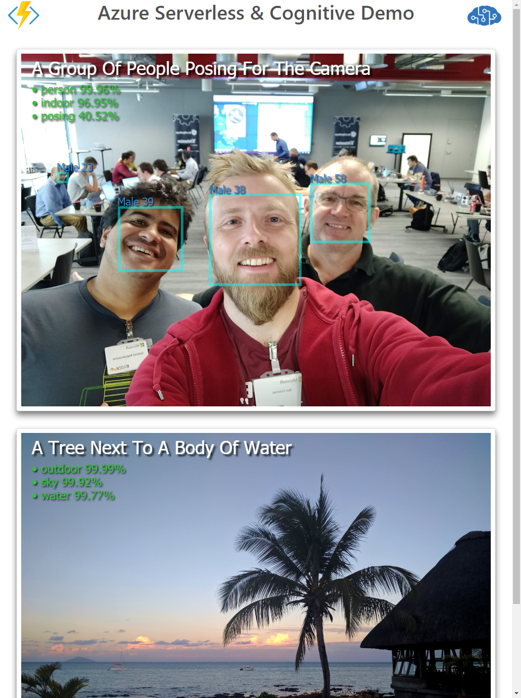

# Overview
This is a multi part application which demonstrates serverless compute with Azure Functions and using pre-built AI models with Cognitive Services 

Users can take photos using their phone, these photos are analysed using computer vision. The results have a description of the image, people's faces and also a set of tags. The demo app updates the photo with information and the results can be viewed on a web page.

The demo consists of four main parts:
- Mobile camera application 
- Two Azure Functions 
- Computer Vision Cognitive Service
- Viewer web app

# Architecture

## Application Flow 

0. User loads camera web app on mobile device, from Azure Function (via a public URL) and takes photo
1. Image is HTTP POSTed from camera app as Base64 string back to same Azure Function
2. Azure Function decodes Base64 data and stores resulting image in Blob Storage into *photo-in* container
3. Second Azure Function is triggered on a new blob arriving at *photo-in* 
4. Function sends image to Cognitive Service API (REST call) and uses result to render a new image with details "drawn" over the photo
5. Result is stored in *photo-out* container in Blob Storage
6. Static HTML5 viewing page polls *photo-out* for new images and updates page dynamically

## Example (Viewer Results)

# Deployment & Setup
The demo requires a single Function App, storage account and Cognitive Services account. Using a consumption plan for the Function means the costs for leaving the demo in place are almost nothing.

- Deploy a new Azure Function App using the Portal (New ➔ Compute ➔ Function App):
  - Pick Windows as the OS.
  - If you have an existing App Service Plan you can use, then select that as the Hosting Plan, otherwise pick "Consumption Plan"
  - Turn off Application Insights
  - Create a new storage account, and make a note of the name
- Add a Computer Vision account (New ➔ AI + Machine Learning ➔ Computer Vision)
  - You **must pick West Europe as the location**, and also F0 (free) as the pricing tier
  - Place in same resource group used for the Function App
- Once the Computer Vision Cognitive Service is deployed, click into the resource and click on keys. Copy "Key 1" somewhere, e.g. into a text file.
- Deploy the function code from this GitHub repo:
  - Go into the Function App from the Portal
  - Click: Platform Features ➔ Deployment Options
  - Click: Setup ➔ Choose Source ➔ External Repository, and enter `https://github.com/benc-uk/serverless-cognitive.git` as the URL
  - It might take a minute, but refresh the list of Functions on the left (where it says "Functions (Read Only)") and *cameraFunction* and *cognitiveFunction* should appear
- Get the URL of the camera app, click: on *cameraFunction* then click on "</> Get function URL", make a note or copy this URL somewhere, as you will need to open it on your mobile. Creating an aks.ms short link is one suggestion
- Configure the functions to access your Cognitive Service:
  - Click on "Overview" tab in the Function Portal and into "Application settings"
  - Click "+ Add new setting"
  - Call the setting **VISION_API_KEY** and paste the key you copied previously as the value
  - Remember to click "Save"
- To configure blob storage, return to the resource group and click into the storage account that was created with the Function App
  - Click on "Blob Service / Containers"
  - Click "+ Container", call it **photo-in** and **set the access level to 'Blob'**
  - Click "+ Container", call it **photo-out** and **set the access level to 'Container'**
  - Click on "Blob Service / CORS", and click "+ Add"
    - Set the rule with '*' (no quotes) for allowed origins, allowed headers and exposed headers, select GET as the allowed verb and leave the max age as 0

# Usage
- Open the camera web app on your phone using the URL you got earlier. The browser will prompt you for camera access. Tapping the image will go full screen
- You must hold your phone in landscape orientation 
- Tap the camera icon to take photo and upload to Azure triggering the whole flow described above 
- Open the viewer page:
  - If you have cloned or downloaded this repo, just open `viewer/index.html` locally in your browser
  - The viewer is currently hosted on GitHub at [**http://hub.benco.io/serverless-cognitive/viewer**](http://hub.benco.io/serverless-cognitive/viewer)
  - **You must append ?sa={storage-account-name} to the URL**, to point the viewer at your storage account, e.g. `http://hub.benco.io/serverless-cognitive/viewer?sa=mystoreaccount`
- Note. The viewer automatically fetches new photos every 10 seconds and displays them, so **do not reload or refresh the page**

# Viewer
If you want to host the viewer yourself in Azure, you can:
- Upload the viewer folder of this repo to blob storage give the container anonymous access and load the pages using the blob endpoint URL, e.g. https://mystoreaccount.blob.core.windows.net/viewer/index.html
- Create an Azure App Service web app and upload the contents of the viewer folder to the root of your web app